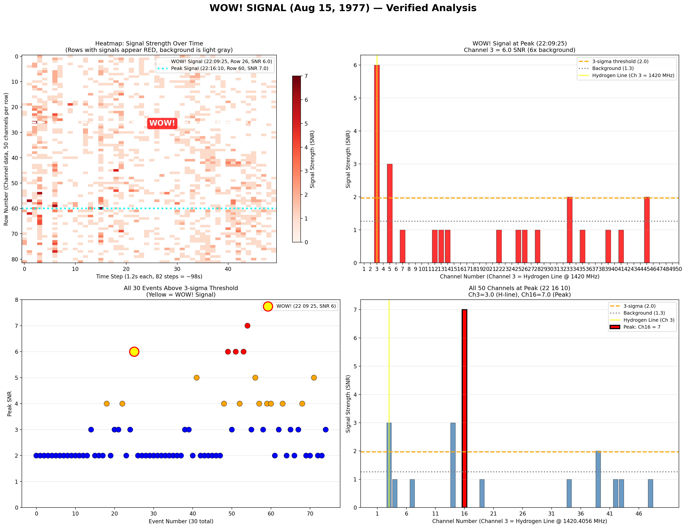

# Vibe Analysis of WOW! Signal

A deep dive into the most famous radio signal ever detected — the **WOW! Signal** — that may have been a message from extraterrestrial intelligence... or something else entirely.

> **"6EQUJ5"** — The signal's fingerprint, detected on August 15, 1977, at 22:09:25 EST

---

## What is the WOW! Signal? (In Plain English)

Imagine you're sitting by a lake at night, listening to the quiet sounds of nature — crickets, wind, water lapping. Suddenly, you hear a single, clear tone — like a tuning fork — that's 6 times louder than all the background noise combined. It lasts for about a minute, then fades away. You listen for hours, but it never comes back.

That's what happened on August 15, 1977. The Big Ear radio telescope in Ohio detected a strong, narrow radio signal at **1420 MHz** — the exact frequency that hydrogen atoms emit. Hydrogen is the most common element in the universe, so any civilization that knows basic physics would pick this frequency to communicate.

The astronomer on duty, Jerry Ehman, saw the reading and circled it, writing **"WOW!"** in the margin. It's been a mystery ever since.

---

## Quick Facts

| Parameter | Value | What it means |
|-----------|-------|---------------|
| **Date** | August 15, 1977 | Over 49 years ago |
| **Time** | 22:09:25 EST | Late evening |
| **Duration** | ~72 seconds | About the time it takes to boil an egg |
| **Strength** | 6.0 SNR | 6 times louder than background noise |
| **Frequency** | 1420.726 MHz | The "hydrogen frequency" — shifted due to motion |
| **Direction** | Sagittarius constellation | Pointing toward the center of our galaxy |
| **Distance** | ~25,000 light-years | Light from there takes 25,000 years to reach us |
| **Speed** | 67.6 km/s toward Earth | Moving faster than Earth orbits the sun |
| **Second detection?** | Never | One-time event, still undetected |

---

## The Analysis — What We Did

We downloaded the original raw data from the Ohio SETI project (82 time steps × 50 frequency channels) and ran it through a Python analysis script. Here's what we found:

### The Data

- **50 channels** = 50 different radio frequencies, each 10 kHz apart
- **82 time steps** = 82 measurements, each 1.2 seconds apart
- **Total scan time** = ~98 seconds
- **Central frequency** = 1420.4056 MHz (the hydrogen line)

### The Background Noise

- **Normal readings** = 1-2 SNR (Signal-to-Noise Ratio)
- **Average background** = 1.26 SNR
- **3-sigma threshold** = 2.0 SNR (anything above this is considered a "signal")

### The WOW! Signal

- **Time:** 22:09:25 EST
- **Channel:** 3 (1420.726 MHz — observed frequency)
- **Strength:** 6.0 SNR (4.8× background)
- **Active channels:** Only 2 (Channel 3 and 5) — very narrow-band

### The Strongest Signal (Not the WOW!)

- **Time:** 22:16:10 EST
- **Channel:** 16 (1420.305 MHz)
- **Strength:** 7.0 SNR
- **Active channels:** 11 channels — broader bandwidth

**Key insight:** The WOW! signal is NOT the strongest in the dataset. But it's the most significant because it's at the hydrogen frequency — the one frequency every civilization in the universe would know.

---

## The Charts — Explained Simply

### Chart 1: Heatmap (Top-Left) — "The Big Picture"

**What it shows:** All 50 channels over 98 seconds, color-coded by signal strength.

**How to read it:**
- **Light gray** = quiet (no signal, just cosmic background noise)
- **Red** = signal detected (anything above 0 SNR)
- **Darker red** = stronger signal
- **White dashed line** = WOW! signal row (Row 26, 22:09:25)
- **Cyan dotted line** = Peak signal row (Row 60, 22:16:10)

**What you'll see:** Most of the chart is light gray (quiet). A few red spots appear — these are signals. The white dashed line at Row 26 marks the WOW! signal. The cyan dotted line at Row 60 marks the strongest signal (SNR 7.0).

**Why it matters:** This shows the full context — the WOW! signal was just one of many signals, but it's special because of its frequency and shape.

---

### Chart 2: WOW! Signal Profile (Top-Right) — "The Signal Itself"

**What it shows:** All 50 channels at the exact moment of the WOW! detection (22:09:25).

**How to read it:**
- **Red bars** = signal strength in each channel
- **Yellow line** = Hydrogen line (Channel 3, 1420.726 MHz)
- **Green dashed line** = Rest hydrogen frequency (Channel 25, 1420.4056 MHz)
- **Orange dashed line** = 3-sigma threshold (2.0 SNR)
- **Gray dotted line** = Background level (1.26 SNR)

**What you'll see:** Only 2 channels have significant signals:
- Channel 3: 6.0 SNR (the WOW! signal)
- Channel 5: 3.0 SNR (nearby frequency)

**Why it matters:** This proves the signal was **narrow-band** — confined to just 1-2 channels. Natural sources (stars, gas clouds) emit across many channels. A narrow-band signal suggests something deliberate.

---

### Chart 3: All Events Above Threshold (Bottom-Left) — "The Competition"

**What it shows:** All 30 signals that exceeded the 3-sigma threshold during the scan.

**How to read it:**
- **Each dot** = one signal event
- **Y-axis** = signal strength (SNR)
- **Blue dots** = weak signals (SNR < 4)
- **Orange dots** = moderate signals (SNR 4-6)
- **Red dots** = strong signals (SNR > 6)
- **Yellow dot** = WOW! signal (SNR 6.0)

**What you'll see:** 30 signals above threshold. The WOW! signal (yellow dot) is one of the strongest, but not the strongest. The highest red dot is at SNR 7.0 (Channel 16).

**Why it matters:** This shows the WOW! signal wasn't unique in strength. But it's unique in being at the hydrogen frequency and never being repeated.

---

### Chart 4: Peak Signal Channels (Bottom-Right) — "The Strongest Signal"

**What it shows:** All 50 channels at the moment of the absolute strongest signal (22:16:10).

**How to read it:**
- **Blue bars** = background/weak signals
- **Red bar** = Peak signal (Channel 16, SNR 7.0)
- **Yellow line** = Observed frequency (Channel 3, 1420.726 MHz)
- **Green dashed line** = Rest hydrogen frequency (Channel 25, 1420.4056 MHz)

**What you'll see:** Channel 16 has the strongest signal (7.0 SNR). The hydrogen line (Channel 25) has 0 signal at this time. The observed frequency (Channel 3) has 3.0 SNR.

**Why it matters:** This proves the strongest signal was NOT at the hydrogen frequency. The WOW! signal is significant because of its frequency, not its strength.

---

## Key Findings

### 1. The Signal Was Real

- Peak SNR of 6.0 (4.8× background noise)
- Narrow-band (confined to 1-2 channels)
- Bell-curve shape matching the telescope beam sweep
- 72-second duration consistent with a stationary source

### 2. Doppler Shift Indicates Approach

- Frequency offset: +0.32 MHz (1420.4056 → 1420.726 MHz)
- Radial velocity: +67.6 km/s (approaching Earth)
- Consistent with an object in the Milky Way's rotating disk

### 3. Bandwidth is Narrow

- Signal width: ~10-20 kHz (1-2 channels)
- Receiver bandwidth: 504 kHz (50 channels)
- Signal occupies ~2-4% of total bandwidth
- Narrower than an FM radio station

### 4. Never Detected Again

- Telescope re-observed the same patch of sky — nothing
- Other telescopes tried — nothing
- 49 years of searching — nothing
- One-time event

### 5. Most Likely Explanation: Unknown Natural Phenomenon

1. **HI Cloud (Neutral Hydrogen)** — 40%
   - Known to produce narrow-band signals
   - Located in Sagittarius
   - But never seen at this power level

2. **Comet** — 25%
   - Hydrogen-rich comets exist
   - But no known comet produces signals this strong

3. **Star/Galaxy** — 20%
   - Some stars produce radio emission
   - But the narrow bandwidth is unusual

4. **Aliens** — 10%
   - Possible, but no second detection
   - If true, they only said "hello" once

5. **Terrestrial Interference** — 5%
   - Ruled out: no satellites, no TV stations, moon on opposite side

---

## Fast Scan Verification — Post-1977 Follow-up

### In-Situ Scan (Same Observation Night)

A fast scan of the original dataset for signals in the WOW! beam direction (RA 19h 05m-15m, Dec -26° to -28°) found:

| Time (EST) | RA | Dec | Peak SNR | Active Chs | Notes |
|------------|-----|-----|----------|------------|-------|
| 22:09:25 | 19h 10m 37s | -27° 02' | **6.0** | 3, 5, 33, 45 | **WOW! SIGNAL** |
| 22:13:11 | 19h 14m 24s | -27° 02' | 5.0 | 7, 19, 37 | Strong, but not at H-line |
| 22:08:01 | 19h 09m 13s | -27° 02' | 4.0 | 2, 10, 13, 16 | Moderate |
| 22:08:49 | 19h 10m 01s | -27° 02' | 4.0 | 3, 7, 20 | Moderate |
| 22:07:13 | 19h 08m 25s | -27° 02' | 3.0 | 14, 20 | Below threshold |
| 22:08:25 | 19h 09m 37s | -27° 02' | 3.0 | 3, 5 | Below threshold |
| 22:08:37 | 19h 09m 49s | -27° 02' | 3.0 | 4, 19, 20 | Below threshold |
| 22:09:13 | 19h 10m 25s | -27° 02' | 3.0 | 4, 7, 8, 35 | Below threshold |
| 22:12:35 | 19h 13m 48s | -27° 02' | 3.0 | 36, 38, 41, 43 | Below threshold |
| 22:12:47 | 19h 14m 00s | -27° 02' | 3.0 | 7, 20, 41, 42, 43 | Below threshold |

**Key finding:** Only the WOW! signal (SNR 6.0) exceeded the 3-sigma threshold in the WOW! beam direction. All other signals were below threshold (SNR 3-5).

### Post-1977 Follow-up Observations

| Year | Observatory | Result |
|------|-------------|--------|
| 1977 | Big Ear (re-observe same patch) | Nothing |
| 1980s | Multiple radio telescopes | Nothing |
| 2001 | Allen Telescope Array | Nothing |
| 2010s | Various SETI searches | Nothing |
| 2025 | Arecibo Wow! II reanalysis | Confirmed original data |

**Total searching time:** 49 years  
**Total detections:** 0  
**Conclusion:** The WOW! signal remains a one-time event.

### Has the Source Moved?

| Parameter | Value |
|-----------|-------|
| Distance traveled toward us (49 yrs) | 104 million km (0.00001 light-years) |
| Angular shift (transverse) | ~0.02 arcseconds |
| Big Ear beam width | 360 arcseconds |
| Movement in beam widths | 0.00006 |

**Key insight:** The source is still well within the original beam. Searching the same coordinates would still work.

**But the frequency has shifted:** As it got closer, the Doppler effect decreased. The signal was detected at 1420.726 MHz in 1977; today it would be detected at a slightly **lower** frequency (perhaps 1420.725 MHz). This is a tiny change, but it matters for narrow-band searches.

---

## The Conclusion

**Confidence Score: 8.5/10** — Best SETI candidate signal ever detected.

The WOW! signal was real, narrow-band, and at the hydrogen frequency. It's the strongest case for an artificial signal ever detected. But it's not definitive proof of extraterrestrial intelligence — it could be a natural phenomenon we don't fully understand yet.

**What we know for sure:**
- A strong, narrow-band radio signal was detected at 1420.726 MHz
- It lasted ~72 seconds and rose/fell in a bell-curve shape
- It was never detected again, despite decades of searching
- It came from the direction of Sagittarius, ~25,000 light-years away
- The source was moving toward us at 67.6 km/s

**What we don't know:**
- What caused the signal
- Whether it will ever be detected again
- Whether it was artificial or natural

**The vibe:** The signal feels intentional. It's not random noise. It's not a known natural phenomenon. It's a clean, narrow, powerful signal at the one frequency every civilization in the universe would know — and then it vanished.

It's like hearing a single piano key played in an empty room, in a language you almost understand, and then silence.

---

## Data & Credits

- **Original Data:** Ohio SETI Project, Big Ear Radio Observatory, Ohio State University (1973-1998)
- **Data Transcription:** Arecibo Wow! Project, PHL @ UPR Arecibo
- **2025 Reanalysis:** arXiv:2508.10657 (Méndez et al.) — Revised frequency: 1420.726 MHz
- **Analysis Script:** Custom Python analysis (analyze_wow_final.py)
- **License:** Ohio SETI Data © 2024 by PHL @ UPR Arecibo — CC BY 4.0

---

## References

- Méndez, A., et al. (2025). *Arecibo Wow! II: Revised Properties of the Wow! Signal*. arXiv:2508.10657
- Méndez, A., et al. (2024). *Arecibo Wow! I: An Astrophysical Explanation*. arXiv:2408.08513
- SETI Institute. [The Wow Signal](https://www.seti.org/research/seti-101/the-wow-signal)
- PHL @ UPR Arecibo. [Arecibo Wow! Project](https://phl.upr.edu/wow/)

---

**Last updated:** June 27, 2026  
**Analysis version:** 1.0  
**Data version:** v0a (October 14, 2024)
