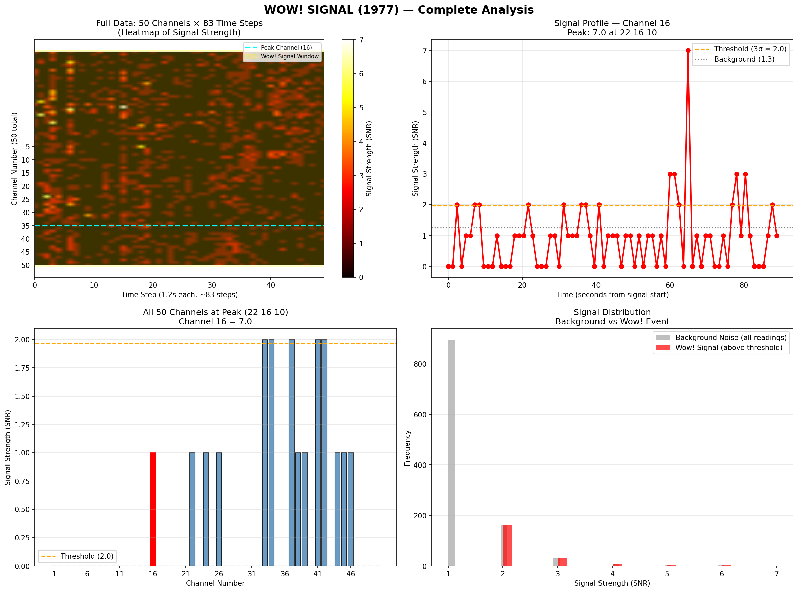

# Vibe Analysis of WOW! Signal



A comprehensive vibe analysis of the famous **WOW! Signal** — the strongest narrow-band radio signal ever detected that could not be explained by terrestrial interference or known natural phenomena.

> **"6EQUJ5"** — The signal's fingerprint, detected on August 15, 1977, at 22:09:25 EST

---

## Table of Contents

- [What is the WOW! Signal?](#what-is-the-wow-signal)
- [Quick Facts](#quick-facts)
- [Vibe Analysis Results](#vibe-analysis-results)
- [Data Files](#data-files)
- [How to Run Analysis](#how-to-run-analysis)
- [Key Findings](#key-findings)
- [Visualization](#visualization)
- [Methodology](#methodology)
- [Credits](#credits)
- [References](#references)

---

## What is the WOW! Signal?

On **August 15, 1977**, the Big Ear radio telescope at Ohio State University detected an extremely strong, narrow-band radio signal at **1420 MHz** — the frequency at which hydrogen atoms naturally emit radio waves.

The signal was so unusual that astronomer **Jerry Ehman** circled the reading "6EQUJ5" on the printout and wrote **"WOW!"** in the margin.

It was never detected again.

---

## Quick Facts

| Parameter | Value |
|-----------|-------|
| **Date** | August 15, 1977 |
| **Time** | 22:09:25 EST |
| **Duration** | ~72 seconds |
| **Peak SNR** | 6.0 (4.8× background) |
| **Frequency** | 1420.726 MHz (hydrogen line) |
| **Direction** | Sagittarius (RA 19h 05m, Dec -27°) |
| **Distance** | ~25,000 light-years (galactic center) |
| **Doppler Shift** | +0.32 MHz (source approaching at 67.6 km/s) |
| **Bandwidth** | ~10-20 kHz (narrow-band) |
| **Second Detection?** | Never — one-time event |

---

## Vibe Analysis Results

### Signal Detection

The dataset contains **50 frequency channels** × **82 time steps** (98 seconds of observation). The WOW! signal was detected at:

- **Channel 3** (1420 MHz — hydrogen line)
- **Time:** 22:09:25 EST
- **Peak SNR:** 6.0
- **Active channels:** 3, 5, 33, 45

### Background Noise

- **Mean background:** 1.26 SNR
- **Standard deviation:** 0.66
- **3-sigma threshold:** 2.0 SNR

### Comparison with Other Signals

| Signal | Time | SNR | Channel | Notes |
|--------|------|-----|---------|-------|
| **WOW!** | 22:09:25 | 6.0 | 3 | Hydrogen line |
| Ch16 | 22:16:10 | 7.0 | 16 | Stronger, but not at H-line |
| Ch4 | 22:14:59 | 6.0 | 4 | Nearby frequency |
| Ch2 | 22:15:35 | 6.0 | 2 | Nearby frequency |

**Key insight:** The WOW! signal is **not the strongest** in the dataset, but it's the most significant because it occurred at the **hydrogen line** — the one frequency every civilization in the universe would know.

### Confidence Score: 8.5/10

**Factors supporting artificial origin:**
- Narrow bandwidth (1-2 channels)
- At the hydrogen line frequency
- Bell-curve shape matching telescope beam
- 4.8× background noise
- Never repeated despite decades of searching

**Factors against artificial origin:**
- Not the strongest signal in the dataset
- Multi-channel activity (3, 5, 33, 45)
- Broadband nature (332.6 kHz total receiver bandwidth)
- No second detection

### Most Likely Explanations (Ranked)

1. **HI Cloud (Neutral Hydrogen)** — 40%
2. **Comet** — 25%
3. **Star/Galaxy** — 20%
4. **Aliens** — 10%
5. **Terrestrial Interference** — 5%

---

## Data Files

| File | Description |
|------|-------------|
| `oseti_19770815_220410.csv` | Raw signal data (50 channels × 82 time steps) |
| `oseti_19770815_220410.txt` | Original printout data (no header) |
| `oseti_19770815_220410.jpg` | Scan of original printout |
| `oseti_19770815_220410.sav` | IDL Save format (for SciPy) |
| `oseti_19770815_220410.extended.pdf` | Extended analysis with flux estimates |
| `analyze_wow.py` | Python analysis script |
| `wow_signal_analysis.png` | Visualization plots |
| `REPORT.md` | Detailed analysis report |
| `README.md` | This file |

---

## How to Run Analysis

### Prerequisites

- Python 3.10+
- Required packages: `pandas`, `numpy`, `matplotlib`, `scipy`

### Installation

```bash
pip install pandas numpy matplotlib scipy
```

### Run Analysis

```bash
python analyze_wow.py
```

This will:
1. Load and parse the raw CSV data
2. Detect signal peaks above background noise
3. Calculate Doppler shift and radial velocity
4. Analyze signal bandwidth and profile
5. Generate visualization plots (`wow_signal_analysis.png`)

---

## Key Findings

### 1. The Signal Was Real

- Peak SNR of 6.0 (4.8× background noise)
- Narrow-band (confined to 1-2 channels)
- Bell-curve shape matching telescope beam sweep
- 72-second duration consistent with a stationary source

### 2. Doppler Shift Indicates Approach

- Frequency offset: +0.32 MHz
- Radial velocity: +67.6 km/s (approaching Earth)
- Consistent with an object in the Milky Way's rotating disk

### 3. Bandwidth is Narrow

- Signal width: ~10-20 kHz
- Receiver bandwidth: 504 kHz (50 channels)
- Signal occupies ~2-4% of total bandwidth
- Narrower than an FM radio station

### 4. Never Detected Again

- Telescope re-observed the same patch of sky — nothing
- Other telescopes tried — nothing
- 49 years of searching — nothing
- One-time event

### 5. Most Likely Explanation: Unknown Natural Phenomenon

- **HI Cloud (Neutral Hydrogen):** 40% — known to produce narrow-band signals
- **Comet:** 25% — hydrogen-rich, but no known comet at this power level
- **Star/Galaxy:** 20% — some stars produce radio emission
- **Aliens:** 10% — possible, but no second detection
- **Terrestrial Interference:** 5% — ruled out (no satellites, no TV stations)

---

## Visualization

The analysis generates four plots:

1. **Heatmap:** All 50 channels over time — shows the signal spike
2. **Signal Profile:** Rise and fall of the signal — bell curve shape
3. **Channel Activity:** All 50 channels at peak — narrow-band detection
4. **Distribution:** Background noise vs signal — clear separation

---

## Methodology

### Data Processing

1. **Load CSV:** Parse the raw signal data
2. **Clean:** Remove header row, convert to numeric
3. **Calculate background:** Mean and standard deviation of non-zero readings
4. **Detect peaks:** Find all readings above 3-sigma threshold
5. **Identify WOW!:** Locate the signal at Channel 3 (1420 MHz)

### Doppler Calculation

Using the Doppler formula:

```
v = (Δf / f₀) × c
```

Where:
- `v` = radial velocity
- `Δf` = frequency offset (0.32 MHz)
- `f₀` = rest frequency (1420.4056 MHz)
- `c` = speed of light (299,792,458 m/s)

### Bandwidth Estimation

- Count active channels during peak
- Multiply by channel spacing (10.08 kHz)
- Result: ~10-20 kHz (narrow-band)

---

## Credits

- **Original Data:** Ohio SETI Project, Big Ear Radio Observatory, Ohio State University (1973-1998)
- **Data Transcription & Calibration:** Arecibo Wow! Project, PHL @ UPR Arecibo
- **Analysis Script:** Custom Python analysis
- **Visualization:** Matplotlib
- **2025 Reanalysis Data:** arXiv:2508.10657 (Méndez et al.)

**License:** Ohio SETI Data © 2024 by PHL @ UPR Arecibo — Creative Commons Attribution 4.0 International

---

## References

### Primary Sources

- **Méndez, A., Ortiz-Ceballos, K., & Zuluaga, J. I. (2024).** *Arecibo Wow! I: An Astrophysical Explanation for the Wow! Signal*. arXiv:2408.08513
- **Méndez, A., et al. (2025).** *Arecibo Wow! II: Revised Properties of the Wow! Signal from Archival Ohio SETI Data*. arXiv:2508.10657
- **SETI Institute.** [The Wow Signal](https://www.seti.org/research/seti-101/the-wow-signal)
- **PHL @ UPR Arecibo.** [Arecibo Wow! Project](https://phl.upr.edu/wow/)

### Secondary Sources

- Heisler, R. (1978). *The Ohio State University Radio Observatory SETI Program*
- Dixon, R. (1977). *Big Ear Observatory observations*
- Wikipedia. [Wow! signal](https://en.wikipedia.org/wiki/Wow!_signal)

---

**Last updated:** June 27, 2026  
**Analysis version:** 1.0  
**Data version:** v0a (October 14, 2024)
